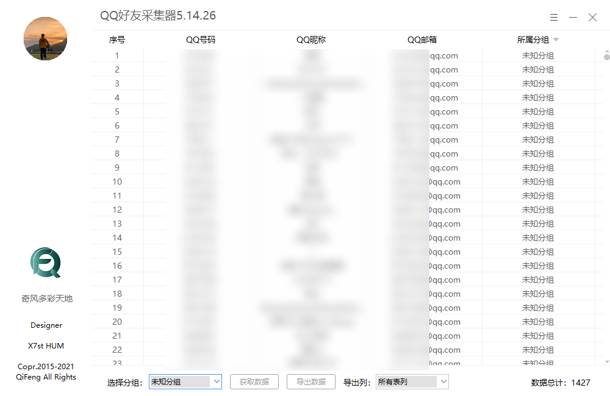

# 好友采集器
【原创】QQ好友采集器5.14.25 支持分组高效导出 简洁实用

## 功能介绍

::: tip 功能介绍
1、采集登录QQ的自定义分组及好友

2、支持导出QQ号码/QQ昵称/QQ邮箱/所属分组

3、高速导出、自定义导出列
:::

## 程序界面

## 更新日志
::: tip 2020.10.14
1、重绘界面，界面更加清爽

2、对部分细节进行优化处理

3、左上角圆圈处支持登退，方便切换账号

4、程序采用扫码登录，安全性高
:::

::: warning 声明
1、该软件为原创软件，任何人未经允许严禁修改软件，否则造成一切后果自负！

2、该软件仅用于技术交流学习和研究的目的，严禁用于非法目的，否则造成一切后果自负！

3、如软件内容侵害到你的权益，请联系我们！
:::

## 下载方式
::: tip
1、为防止他人恶意下载使用，本程序已暂停免费下载（已下载的用户不受影响）

2、创作不易，该程序将收取 15元 作为费用（不定时免费赠送）

3、请联系 [我的QQ](http://wpa.qq.com/msgrd?v=3&uin=17916881&site=qq&menu=yes)：17916881 获取下载链接
